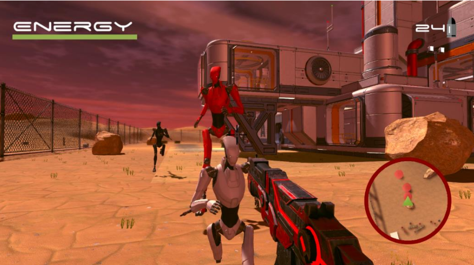
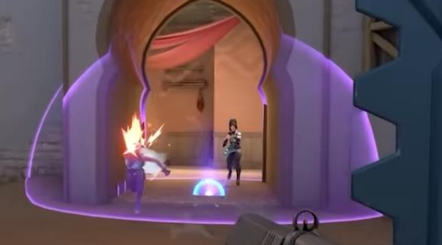
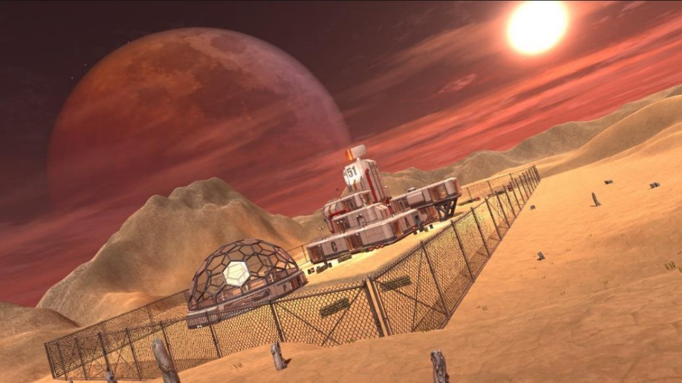
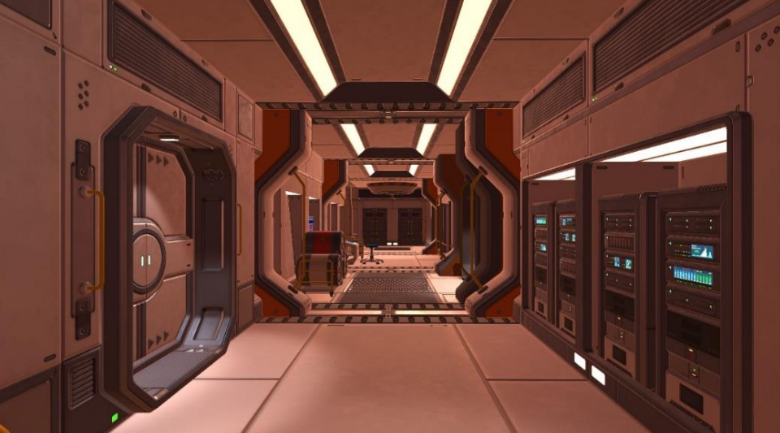

# Game Design Document

## Description
This Game Design Document (GDD) provides a comprehensive blueprint for the creation of a fully immersive game titled "Defeated By Artificial Intelligence (DAI)."

The document includes detailed sections on game analysis, storyline, character development, gameplay mechanics, level design, and user interface aesthetics.

The game is set in a post-apocalyptic world where players must navigate through intense challenges, solve complex puzzles, and engage in strategic combat to survive and uncover the truth about their existence.

The GDD serves as a complete guide for developers to bring this innovative and thrilling game to life, showcasing a blend of strategy, action, and adventure.

## Cover and Key Moments

**Gameplay Image**  

**Game Finale**  

## Characters
This section introduces the key characters that drive the story in "Defeated By AI (DAI)".

## Game Mechanics
This section provides an overview of the core mechanics that make the gameplay engaging and strategic.

## Level Design
The level design section is a crucial part of the GDD, outlining how each level is structured and the challenges players will face.  
**Please refer to the attached document in the GitHub repository for detailed explanations of the level design and how each element functions.**

## Game Aesthetics
The aesthetics of the game play a significant role in immersing players in the world of "Defeated By AI (DAI)".

## User Interface (UI)
The UI design is critical for ensuring an intuitive and seamless player experience.

## Documentation
For a detailed explanation of how the game is designed and functions, as well as a breakdown of each aspect of the game, please refer to the attached Game Design Document (GDD) in this GitHub repository. This README serves as a brief overview, with the GDD providing in-depth insights into every component of the game.
